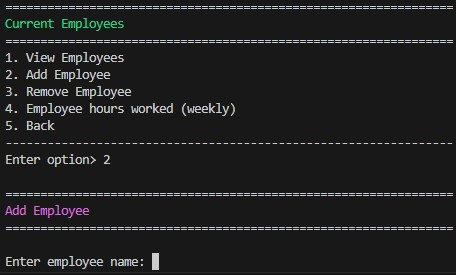

T1A3 - Terminal Application - Mark Navarro
https://github.com/navko11/TerminalApp/tree/master

The project that I have decided to make is a replication of a simple payroll system.
The system will allow you to view/add/remove employees and input basic information of employees.
After all the inputs are declared with values, the result of the payslip of the employee will be displayed.

Python version 3.11.4

As long as the python version is above 3.7 the app should run with no problem
I had to input these commands in order to open virtual environment in my Windows system, it may be different for linux/mac users.
1. python -m venv tutorial-env              
2. Set-ExecutionPolicy Unrestricted -Scope Process
3. tutorial-env\Scripts\activate
4. python main.py

Packages used taken from https://pypi.org/:
pip install art
pip install colorama              

Features of the app:

1. Adding employee information

2. Removing employee

3. Displaying employees payslip with defined inputs

