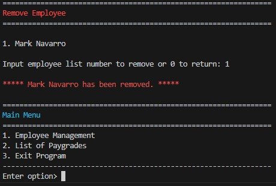
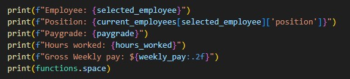

T1A3 - Terminal Application - Mark Navarro
https://github.com/navko11/TerminalApp/tree/master

The project that I have decided to make is a replication of a simple payroll system.
The system will allow you to view/add/remove employees and input basic information of employees.
After all the inputs are declared with values, the result of the payslip of the employee will be displayed.

Python version 3.11.4

As long as the python version is above 3.7 the app should run with no problem
I had to input these commands in order to open virtual environment in my Windows system, it may be different for linux/mac users.
1. python -m venv tutorial-env              
2. Set-ExecutionPolicy Unrestricted -Scope Process
3. tutorial-env\Scripts\activate
4. python main.py

Packages used taken from https://pypi.org/:
- pip install art
- pip install colorama              

Features of the app:

1. Adding employee information

- When in add menu option, user will be prompted to input new employee details.

- When completed, confirmation in green text will output.

- Employee class and function is created to define the information inputted by the user.
- While loop is used to handle the error if invalid input is made in that input.
.jpg)

- Inputs are transferred as a key and value and is stored to a dictionary.
- Functions are included and imported from other modules.
.jpg)

- If input is not 1-6 error message will be thrown and user can attempt to input valid number.

2. Removing employee

- Prompt to ask user to remove existing employee.

- If there are no employees to remove, error will output in red text.

- When employee is selected confirmation in red text will output.

- Remove code includes control structures and nested looping.
- Code will call the variable with all the stored data of employees by name.
- Built in function "Enumerate" used to show employees in an ordered list.

- Example of Enumerate with extra added employees output

3. Displaying employees payslip with defined inputs

- Option calls variable with existing employees in ordered list

- Hours input will display all employee details and payslip

- Defines salary level variables and converts them to hourly rate

- Conditional statement that takes the employees stored data (paygrade) and matches it to the corresponding salary level.

- Output all details of employee with finalized all input actions.

